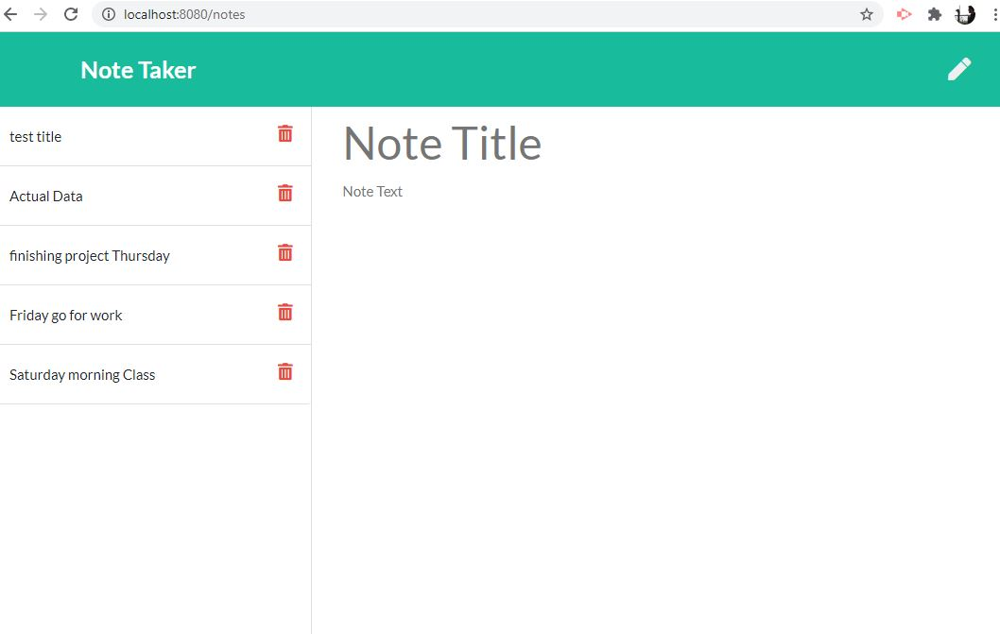

# Note-taker
# Table of Contents
- [Description](#Description)
- [Technologies](#Technologies)
- [Installation](#Installation)
- [Usage](#Usage)
- [Deployment](#Deployment)
- [Screenshots](#Screenshots)
# Description 
**Note-taker** is a simple note taking app.
This app allows user to take note, delete note, save them in a json file and rerender on adding/deleting new notes.
As a samll business owner there are lots of things to accomplish ia a day to run the business sucessfully.
# Technology 
Technologies utilized include
- node.js
- express.js
- javascript
- HTML & CSS
- Heroku
# Installation
To run this program sucessfully
- clone the github repo. Local machine should have node.js installed.
- In the terminal, navigate to folder and install all required dependencies (npm install).
# Usage
- Once installation finished navigate to server.js file and open in terminal
- And type npm start which will take you to the browser.

 # Deployment
 - [Deployed App](https://noteapper.herokuapp.com/)
 
 # Screenshots

